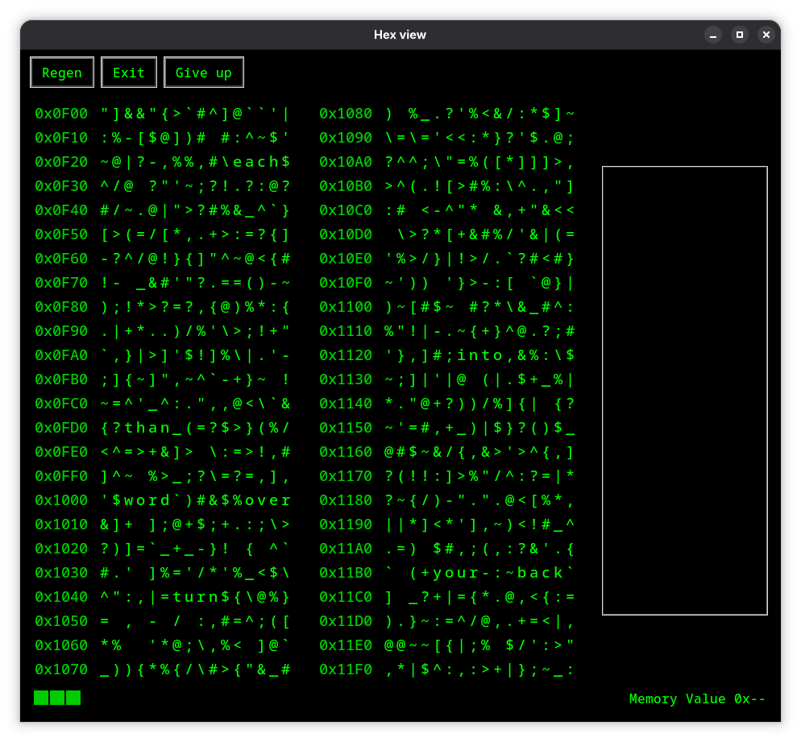

# Hex Viewer – Word-Finding Game

This application combines a **hex-style memory view** with a **word-finding puzzle** and **bracket-matching**. The display looks like a two-column memory dump; hidden among random symbols are eight 4-letter English words, one of which is a secret. The user finds words and bracket pairs while trying to discover the secret word with limited feedback.

**This code was generated using Cursor AI.**

---

## Ideas Behind the Application

1. **Hex / memory aesthetic**  
   The main area mimics a hex editor or memory dump: two columns of 16×24 characters, each with a hex address column. Characters are punctuation/symbols (no letters or digits) except where words are placed. The look is black background with neon green text.

2. **Hidden words**  
   Eight distinct 4-letter English words are placed at random in the grid (no overlap, at least one character gap between words on the same row). One of these is chosen at random as the **secret code**. Clicking a word gives feedback: how many letters match the secret in the same position (e.g. "Found word: 2"). Clicking the secret word ends the game and disables further interaction.

3. **Bracket matching**  
   Pairs `{}`, `[]`, `<>`, `()` are matched **lazily** and **within each column only** (no cross-column matches). Hovering over an **opening** bracket inverts the whole matched range; clicking highlights it and removes one non-secret word from the grid (replaced with spaces). If no non-secret word can be removed, an "Error" message is shown.

4. **Limited attempts**  
   Three green squares on the status line turn red (rightmost first) when the user clicks wrong words. This gives a simple “lives” or attempt counter.

5. **Message log and status**  
   A third column logs events ("Match found", "Found word: N", "Secret found", "Error"). A status line shows the three attempt squares and the hex value of the character under the mouse ("Memory Value 0xXX").

---

## How It Works

### Layout

- **Top:** Menu bar with **Regen**, **Exit**, and **Give up**.
- **Main area:** Two “memory” columns side by side:
  - Each column: hex address column (e.g. `0x0F00`) + 16 characters × 24 rows.
  - First column starts at address `0x0F00`; second column starts right after the first (addresses continue).
- **Right:** Message column (scrollable, newest at bottom; old lines scroll off the top when full).
- **Bottom:** Status line with three square indicators (green → red on wrong word clicks) and “Memory Value 0xXX” (hex of character under cursor).

### Interactions

- **Hover:** Any character inverts (green bg, black text). If the character is an **opening** bracket with a valid match in the same column, the **entire** matched range inverts. No hover effect for already click-highlighted matches; no range invert when hovering the closing bracket alone.
- **Click character:**
  - **Part of the secret word:** Message “Secret found”; secret word letters turn red; all further clicks/hover are disabled.
  - **Part of another word:** Word is highlighted (same style as bracket matches). First time that word is clicked: message “Found word: N” (N = same-position letter matches with secret); one status square turns red (rightmost first). That word stays highlighted and is not reported again.
  - **Bracket (with match):** Range is highlighted. First time that match is clicked: message “Match found”; one non-secret word is removed (replaced with spaces, no longer clickable). If no non-secret word remains to remove, message “Error” is shown. The secret word is never removed.

### Menu

- **Regen:** New random grid (new symbols, new word placements, new secret), all counters and messages reset, status squares back to green.
- **Exit:** Closes the application.
- **Give up:** Same as finding the secret: message “Secret found”, secret word letters turn red, interaction disabled.

### Technical Notes

- Bracket matching is **lazy** (e.g. first `}` to the right for `{`) and **per-column** (each 16-character column is matched independently).
- Words are placed so they do not overlap and keep at least one character gap on the same row.
- The message column keeps a fixed number of lines; adding a new line scrolls the oldest off the top.

---

## Running the Application

- **Requirements:** Python 3 with `tkinter` (e.g. on Fedora: `sudo dnf install python3-tkinter`).
- **Run:** `python3 hex_viewer.py` (or `python hex_viewer.py`).

---

## File

- `hex_viewer.py` – Single-file Tkinter application; all logic and UI in one module.
